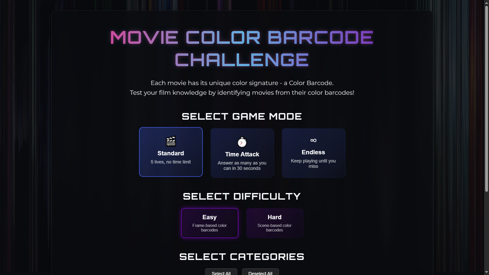

# Movie Barcode Challenge



A full-stack MERN application that challenges users to identify movies based on their unique color barcodes - temporally linear combinations of prominent colors from each frame in chronological order.

## 🌟 Features

- **Multiple Game Modes**:
  - **Standard**: Classic gameplay with lives system
  - **Time Attack**: Race against the clock
  - **Endless**: Continuous play with progressive difficulty

- **Difficulty Levels**:
  - **Easy**: Frame-by-frame color bars
  - **Hard**: Single-color representation per frame

- **Movie Categories**: Filter challenges by genre, era, director, etc.

- **User Features**:
  - Secure authentication and profile management
  - Game history and statistics
  - Personal high scores tracking

- **Competitive Elements**:
  - Global leaderboards
  - Performance statistics
  - Achievement badges

- **Admin Dashboard**:
  - Comprehensive content management
  - User administration
  - Game statistics and analytics

- **Responsive Design**:
  - Works on desktop, tablet, and mobile
  - Immersive UI with animated backgrounds

## 🚀 Quick Start

### Prerequisites

- Node.js (v14+)
- MongoDB
- Git

### Installation

1. **Clone the repository**:

   ```bash
   git clone https://github.com/AkashKK25/movie-barcode-challenge-FS.git
   cd movie-barcode-challenge
   ```

2. **Install backend dependencies**:

   ```bash
   cd server
   npm install
   ```

3. **Install frontend dependencies**:

   ```bash
   cd ../client
   npm install
   ```

4. **Set up environment variables**:
   Create `.env` file in the server directory:
   ```
   PORT=5000
   MONGODB_URI=mongodb://localhost:27017/movie-barcode-game
   JWT_SECRET=your_jwt_secret_key_here
   NODE_ENV=development
   ```

5. **Start the development servers**:
   ```bash
   # Start backend (from server directory)
   npm run dev
   
   # Start frontend (from client directory)
   npm start
   ```

6. **Create an admin user**:
   ```bash
   cd ../server
   node createAdmin.js
   ```

7. **Access the application**:
   - Frontend: [http://localhost:3000](http://localhost:3000)
   - Backend API: [http://localhost:5000](http://localhost:5000)

## 🎮 How to Play

1. **Register/Login**: Create an account or login
2. **Choose Game Mode**: Select your preferred game mode
3. **Select Difficulty**: Choose between Easy and Hard modes
4. **Select Category**: Filter by movie category (optional)
5. **Start Playing**: Identify movies from their color barcodes
6. **Climb the Leaderboard**: Compete for the highest scores

## 🧠 Game Mechanics

Movie color barcodes are created by:
1. Sampling frames from a movie at regular intervals
2. In Easy mode, preserving the frame image but resizing to a single vertical line
3. In Hard mode, calculating the average color of each frame
4. Arranging these colors chronologically from left to right

This creates a unique "fingerprint" for each film that captures its visual essence, color palette, and pacing.

## 📸 Movie Barcode Generation

The repository includes a Python script to generate your own movie barcodes:
```bash
# Install required packages
pip install moviepy numpy pillow

# Run the generator
python movie_barcode_generator.py
```

## 🛠️ Technologies Used

### Frontend
- React.js
- Redux Toolkit
- Material UI
- Framer Motion
- Axios

### Backend
- Node.js
- Express.js
- MongoDB
- JWT Authentication
- Multer

### Deployment
- Docker
- Netlify/Render/Heroku

## 📚 Project Structure

```
movie-barcode-challenge/
├── client/                 # Frontend React application
│   ├── public/
│   ├── src/
│   │   ├── components/     # UI components
│   │   ├── pages/          # Page components
│   │   ├── slices/         # Redux slices
│   │   ├── App.js          # Main application component
│   │   └── store.js        # Redux store
│   └── package.json
│
├── server/                 # Backend Node.js application
│   ├── controllers/        # API controllers
│   ├── middleware/         # Express middleware
│   ├── models/             # MongoDB models
│   ├── routes/             # API routes
│   ├── uploads/            # Uploaded files
│   ├── index.js            # Entry point
│   └── package.json
│
├── Movie Color Barcodes Easy/  # Easy mode barcode images
├── Movie Color Barcodes Hard/  # Hard mode barcode images
├── docker-compose.yml          # Docker configuration
├── movie_barcode_generator.py  # Python script for generating barcodes
└── README.md                   # Project documentation
```

## 🔄 API Endpoints

### Authentication
- `POST /api/users`: Register a new user
- `POST /api/users/login`: User login
- `GET /api/users/profile`: Get user profile
- `PUT /api/users/profile`: Update user profile

### Game
- `GET /api/movies/game`: Get movies for game
- `GET /api/movies/categories`: Get movie categories
- `POST /api/games`: Start a new game session
- `PUT /api/games/:id/movie`: Add movie result to game session
- `PUT /api/games/:id/complete`: Complete game session

### Leaderboard
- `GET /api/games/leaderboard`: Get leaderboard

### Admin
- `GET /api/admin/stats`: Get admin statistics
- `GET /api/admin/users`: Get all users
- `DELETE /api/admin/users/:id`: Delete user
- `POST /api/admin/movies`: Add new movie
- `DELETE /api/admin/movies/:id`: Delete movie

## 🙏 Acknowledgements

- Inspired by the work of [The Colors of Motion](https://thecolorsofmotion.com/)

## 👨‍💻 Contributing

Contributions are welcome! Please feel free to submit a Pull Request.

1. Fork the repository
2. Create your feature branch (`git checkout -b feature/AmazingFeature`)
3. Commit your changes (`git commit -m 'Add some AmazingFeature'`)
4. Push to the branch (`git push origin feature/AmazingFeature`)
5. Open a Pull Request
